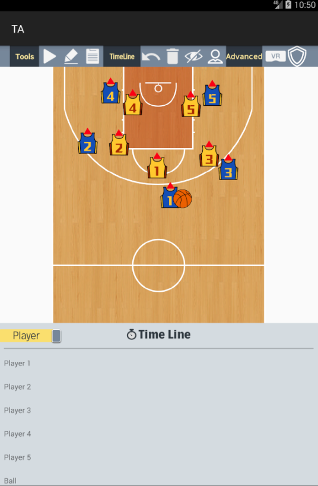
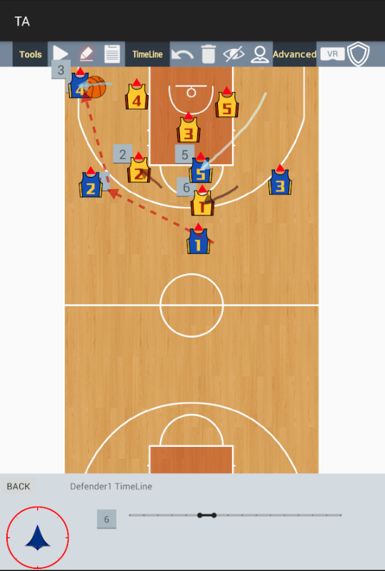

# Baseketball Tactic Board
An Android app of baseketball tactic board. 
Users can draw tactics on and ipad and save the content of tactics. Furthermore, this app can be connected to a VR system to use the tactic information for the training.

## Overview
- System Overview

## Screen Shot
- Draw Tactic

## Environment
- Android version - 9 (Pie)
- Android studio - 4.0.1
- SDK version - 29
- Support Library Packages - Androidx

## Appendix
Please reference these page.
https://www.notion.so/2D-Basketball-Tactic-Board-683fcd62361f4da3b38ee815c1951da8
https://www.notion.so/Code-Review-2020-9b4d769e8370420495393b4a9e09aa8c
